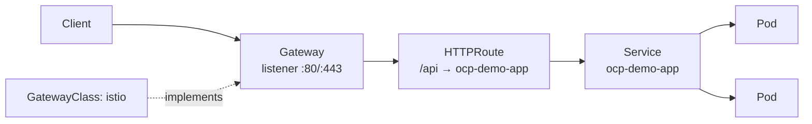

# ACT 4 — Gateway API Introduction

> **Script:** `scripts/12-gateway-api.sh`
> **Overview:** OpenShift Connectivity Link adopts the Kubernetes **Gateway API** — a role-oriented, vendor-neutral standard for ingress — as the foundation on which traffic security, protection, and observability policies are layered in the rest of ACT 4.

---

## Why a New Act

ACT 2 and ACT 3 used **Routes** — OpenShift's original, simple way to expose an application over HTTP/HTTPS. Routes are excellent for getting a single service online quickly, but they were designed before the need for portable, policy-driven, multi-team connectivity became common.

> **Key point:** ACT 4 does not replace what came before — it shows the *next* layer. Gateway API is where platform teams, security teams, and application teams share one model for exposing and protecting traffic.

---

## Mental Model

**Route vs. Gateway API**

```
Route (legacy)            Gateway API (standard)
──────────────────       ─────────────────────────────
Single resource          Layered resources, separate owners
Cluster-specific CRD      Portable Kubernetes standard (SIG-Network)
One team owns it all     GatewayClass → Gateway → HTTPRoute
Limited policy hooks     Rich policy attachment (TLS, Auth, RateLimit)
```

**The three core resources — and who owns them**

| Resource | Owner | Responsibility |
|---|---|---|
| `GatewayClass` | Platform / Infra | Declares *which controller* implements Gateways (here: `istio`) |
| `Gateway` | Cluster / Network ops | Defines listeners — ports, protocols, hostnames, TLS |
| `HTTPRoute` | Application team | Maps a hostname/path to a backend Service |

> **Key point:** This separation of concerns is the whole point. The infra team owns the entry point (`Gateway`); the app team owns routing (`HTTPRoute`) — without either needing access to the other's resources.

---

## How It Fits Together



> **Note:** In ACT 4, the **Gateway** is the attachment point for the policies that follow — `TLSPolicy` (13–14), `AuthPolicy` (15), `RateLimitPolicy` (16), and external metadata authorization (17). Establishing the Gateway correctly here is the foundation for all of them.

---

## Steps

### 1. Confirm Gateway API Is Available

Connectivity Link (Kuadrant) installs the Gateway API CRDs and an Istio-based controller. Confirm the API is present:

```bash
oc get crd | grep gateway.networking.k8s.io
# gatewayclasses.gateway.networking.k8s.io
# gateways.gateway.networking.k8s.io
# httproutes.gateway.networking.k8s.io
```

> **Note:** If these CRDs are missing, Connectivity Link / Kuadrant is not installed. Revisit the pre-demo checklist before continuing.

---

### 2. Inspect the GatewayClass

```bash
oc get gatewayclass
# NAME    CONTROLLER                    ACCEPTED
# istio   istio.io/gateway-controller   True
```

> **Key point:** `ACCEPTED: True` means a controller has claimed this class and will reconcile any `Gateway` that references it. The platform team manages this once; application teams simply reference it by name.

---

### 3. Create the Gateway

The script applies the following resource (idempotent — re-running updates in place):

```yaml
apiVersion: gateway.networking.k8s.io/v1
kind: Gateway
metadata:
  name: demo-gateway
  namespace: ocp-demo
spec:
  gatewayClassName: istio
  listeners:
    - name: http
      protocol: HTTP
      port: 80
      hostname: "*.apps.<cluster-domain>"
      allowedRoutes:
        namespaces:
          from: Same
```

| Field | Meaning |
|---|---|
| `gatewayClassName: istio` | Delegates implementation to the Connectivity Link controller |
| `listeners[].hostname` | Wildcard host this entry point will accept traffic for |
| `allowedRoutes.namespaces.from: Same` | Only `HTTPRoute`s in this namespace may attach (least privilege) |

> **Tip:** A single `Gateway` can expose many applications through many `HTTPRoute`s. We start with one listener now and add TLS in the next steps.

---

### 4. Watch the Gateway Become Programmed

```bash
oc get gateway demo-gateway -n ocp-demo
# NAME           CLASS   ADDRESS          PROGRAMMED   AGE
# demo-gateway   istio   a1b2c3...elb...  True         30s
```

The script waits for the `Programmed` condition:

```bash
oc wait gateway/demo-gateway -n ocp-demo \
  --for=condition=Programmed --timeout=120s
```

> **Key point:** `PROGRAMMED: True` means the controller has provisioned the underlying data-plane (an Istio ingress gateway) and assigned an external `ADDRESS`. The entry point is live — but nothing is routed to it yet. That is the job of the `HTTPRoute` in the next step.

---

### 5. Inspect Gateway Status

```bash
oc get gateway demo-gateway -n ocp-demo -o yaml | oc neat 2>/dev/null || \
  oc get gateway demo-gateway -n ocp-demo -o jsonpath='{.status.conditions}'
```

Look for the two key conditions:

- `Accepted: True` — the spec is valid and the controller adopted it
- `Programmed: True` — the data-plane is provisioned and reachable

---

## Recap

| Concept | Takeaway |
|---|---|
| Gateway API | A portable, role-oriented standard replacing ad-hoc ingress |
| GatewayClass | Platform-owned binding to a controller (`istio`) |
| Gateway | Network-owned entry point — listeners, hosts, TLS |
| HTTPRoute | App-owned routing (covered next, step 13) |
| Policy attachment | Gateways are the anchor for TLS / Auth / RateLimit policies |

> **Tip:** Nothing reaches the application yet — a `Gateway` only opens the door. In the next step we attach an `HTTPRoute` so traffic actually flows to `ocp-demo-app`.

---

## ⬅️ Previous: [Self-Healing Pods](11-self-healing.md) | ➡️ Next: [Expose Application with HTTPRoute](13-http-route.md)
