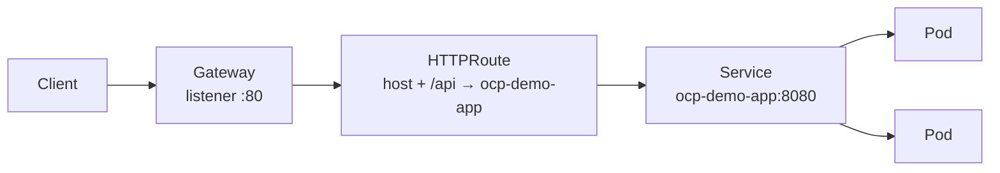

# ACT 4 — Expose Application with HTTPRoute

> **Script:** `scripts/13-http-route.sh`
> **Overview:** Step 12 opened the door with a `Gateway`. This step attaches an **`HTTPRoute`** — the application-team-owned resource that maps a hostname and path to a backend `Service`, so traffic finally flows all the way to `ocp-demo-app`.

---

## Where We Are

In step 12 we created a `Gateway` and watched it become `Programmed` — the controller provisioned a data-plane and assigned an external address. But a `Gateway` only opens a listening port; it routes nothing on its own.

> **Key point:** The `Gateway` is the **entry point** (owned by network/infra). The `HTTPRoute` is the **routing rule** (owned by the app team). Separating them is the core value of Gateway API: the app team exposes a service without ever touching the Gateway.

---

## Mental Model

```
Gateway (step 12)             HTTPRoute (this step)
──────────────────────       ─────────────────────────────
Opens listener :80            Maps host + path → Service
Network/infra owned           Application-team owned
"the front door"             "which room the visitor goes to"
```

**`HTTPRoute` anatomy**

| Field | Meaning |
|---|---|
| `parentRefs` | Which `Gateway` (and namespace) this route attaches to |
| `hostnames` | The host(s) this route answers for — must match a Gateway listener |
| `rules[].matches` | Conditions to match a request (here: path prefix `/api`) |
| `rules[].backendRefs` | The target `Service` and port (`ocp-demo-app:8080`) |

---

## How It Fits Together



> **Note:** The route's `hostname` must fall within the Gateway listener's wildcard. The listener accepts `*.apps.<cluster-domain>`, so the route uses `ocp-demo-app.apps.<cluster-domain>`.

---

## Steps

### 1. Confirm the Gateway Is Ready

The route can only attach to an existing, programmed `Gateway`:

```bash
oc get gateway demo-gateway -n ocp-demo
# NAME           CLASS               ADDRESS        PROGRAMMED
# demo-gateway   openshift-default   52.142.84.93   True
```

> **Note:** If the Gateway is missing, run `scripts/12-gateway-api.sh` first.

---

### 2. Confirm the Backend Service

The `HTTPRoute` forwards to a `Service`, so the app must already be deployed:

```bash
oc get svc ocp-demo-app -n ocp-demo
# NAME           TYPE        CLUSTER-IP      PORT(S)
# ocp-demo-app   ClusterIP   172.30.x.x      8080/TCP
```

---

### 3. Create the HTTPRoute

The script applies the following resource (idempotent — re-running updates it):

```yaml
apiVersion: gateway.networking.k8s.io/v1
kind: HTTPRoute
metadata:
  name: ocp-demo-app
  namespace: ocp-demo
spec:
  parentRefs:
    - name: demo-gateway
      namespace: ocp-demo
  hostnames:
    - ocp-demo-app.apps.<cluster-domain>
  rules:
    - matches:
        - path:
            type: PathPrefix
            value: /api
      backendRefs:
        - name: ocp-demo-app
          port: 8080
```

> **Tip:** Multiple `rules` and `matches` let one route split traffic by path, header, or method — the same primitive used later for canary releases and policy targeting.

---

### 4. Verify the Route Was Accepted

A route reports its status **per parent Gateway**. Look for `Accepted: True` and `ResolvedRefs: True`:

```bash
oc get httproute ocp-demo-app -n ocp-demo \
  -o jsonpath='{.status.parents[0].conditions}'
# Accepted=True (Accepted)
# ResolvedRefs=True (ResolvedRefs)
```

> **Key point:** `Accepted: True` means the Gateway adopted the route; `ResolvedRefs: True` means the backend `Service` and port were found. Both must be `True` before traffic flows.

---

### 5. Call the App Through the Gateway

The Gateway exposes its own external address (separate from the legacy Route). The script uses `curl --resolve` so the request reaches the Gateway load balancer regardless of DNS:

```bash
curl --resolve ocp-demo-app.apps.<domain>:80:<gateway-address> \
  http://ocp-demo-app.apps.<domain>/api/info
```

> **Note:** Traffic now travels **Client → Gateway → HTTPRoute → Service → Pods**, fully through the Gateway API path rather than the legacy `Route` from ACT 2.

---

## Recap

| Concept | Takeaway |
|---|---|
| `HTTPRoute` | App-owned rule mapping host + path to a `Service` |
| `parentRefs` | Binds the route to the `Gateway` from step 12 |
| Hostname match | Route host must fall within the Gateway listener wildcard |
| Status conditions | `Accepted` + `ResolvedRefs` must both be `True` |
| End-to-end path | Client → Gateway → HTTPRoute → Service → Pods |

> **Tip:** Traffic flows, but still over plain HTTP. In the next step we attach a `TLSPolicy` to secure the Gateway entry point.

---

## ⬅️ Previous: [Gateway API Introduction](12-gateway-api.md) | ➡️ Next: [Secure Traffic with TLSPolicy](14-tls-policy.md)
