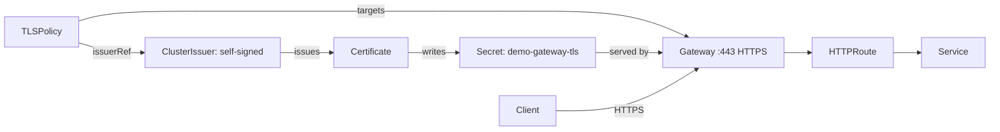

# ACT 4 — Secure Traffic with TLSPolicy

> **Script:** `scripts/14-tls-policy.sh`
> **Overview:** Step 13 routed traffic over plain HTTP. This step attaches a Kuadrant **`TLSPolicy`** to the `Gateway`, adding an HTTPS listener whose certificate is automatically issued and renewed by **cert-manager** — no manual certificate handling.

---

## Where We Are

- **Step 12** opened the `Gateway` (HTTP listener on `:80`).
- **Step 13** attached an `HTTPRoute` so traffic reaches `ocp-demo-app`.
- **Step 14 (this step)** secures the entry point: an HTTPS listener on `:443`, with TLS terminated at the Gateway.

> **Key point:** `TLSPolicy` is a **policy attachment** — it targets the `Gateway` without modifying the app or the `HTTPRoute`. Security is layered on, owned by the platform/security team.

---

## Mental Model

**How the pieces cooperate**

| Resource | Owner | Responsibility |
|---|---|---|
| `ClusterIssuer` (cert-manager) | Platform / Security | Defines *how* certificates are issued (here: `self-signed`) |
| Gateway HTTPS listener | Network ops | Declares `:443` + `tls.mode: Terminate` + a secret to read the cert from |
| `TLSPolicy` (Kuadrant) | Security | Binds the Gateway to an issuer; drives cert-manager to fill the secret |
| `Certificate` + `Secret` | cert-manager (generated) | The issued cert material, auto-renewed |

> **Key point:** The Gateway's `certificateRefs` secret does **not** need to exist beforehand. The `TLSPolicy` triggers cert-manager to create a `Certificate`, which populates that `Secret`, which the listener then serves.

---

## How It Fits Together



---

## Steps

### 1. Confirm Prerequisites

`TLSPolicy` needs the Kuadrant CRDs, cert-manager, and a Ready issuer:

```bash
oc get crd tlspolicies.kuadrant.io certificates.cert-manager.io
oc get clusterissuer self-signed
# NAME          READY   AGE
# self-signed   True    90d
```

> **Note:** The demo cluster ships a Ready `self-signed` ClusterIssuer. For production-like certificates, point `GATEWAY_TLS_ISSUER` at an ACME/Let's Encrypt issuer in `demo-config.sh`.

---

### 2. Add an HTTPS Listener to the Gateway

The script re-applies the Gateway with both listeners — the existing HTTP `:80` and a new HTTPS `:443`:

```yaml
listeners:
  - name: http
    protocol: HTTP
    port: 80
  - name: https
    protocol: HTTPS
    port: 443
    hostname: "*.api.<cluster-domain>"
    tls:
      mode: Terminate
      certificateRefs:
        - kind: Secret
          name: demo-gateway-tls   # populated by cert-manager
```

> **Tip:** `mode: Terminate` means TLS ends at the Gateway; traffic continues to pods over the cluster network. The referenced secret is created later by cert-manager — the listener simply waits for it.

---

### 3. Apply the TLSPolicy

```yaml
apiVersion: kuadrant.io/v1
kind: TLSPolicy
metadata:
  name: demo-gateway-tls
  namespace: ocp-demo
spec:
  targetRef:
    group: gateway.networking.k8s.io
    kind: Gateway
    name: demo-gateway
  issuerRef:
    group: cert-manager.io
    kind: ClusterIssuer
    name: self-signed
```

> **Key point:** `targetRef` binds the policy to the Gateway; `issuerRef` tells cert-manager which issuer to use. Kuadrant then generates a `Certificate` for each HTTPS listener hostname.

---

### 4. Watch cert-manager Issue the Certificate

```bash
oc get certificate -n ocp-demo
oc wait --for=condition=Ready certificate -n ocp-demo --all --timeout=120s
oc get secret demo-gateway-tls -n ocp-demo
```

> **Note:** Once the `Certificate` is `Ready`, the `Secret` is populated and the Gateway's HTTPS listener becomes `Programmed`.

---

### 5. Verify HTTPS Through the Gateway

```bash
curl -sk --resolve ocp-demo-app.api.<domain>:443:<gateway-address> \
  https://ocp-demo-app.api.<domain>/api/info
```

> **Note:** `-k` accepts the self-signed certificate for the demo. With a trusted (ACME) issuer the `-k` flag is unnecessary and browsers show a valid padlock.

---

## Recap

| Concept | Takeaway |
|---|---|
| `TLSPolicy` | Policy attachment that secures a `Gateway` declaratively |
| `issuerRef` | Delegates certificate issuance to a cert-manager issuer |
| HTTPS listener | `:443` with `tls.mode: Terminate` reading a managed secret |
| cert-manager | Issues and auto-renews the certificate — no manual handling |
| Separation of concerns | App and `HTTPRoute` are untouched; security is layered on |

> **Tip:** Traffic is now encrypted, but anyone can still call the API. In the next step we add an `AuthPolicy` to require authentication.

---

## ⬅️ Previous: [Expose Application with HTTPRoute](13-http-route.md) | ➡️ Next: [Protect API with AuthPolicy](15-auth-policy.md)
