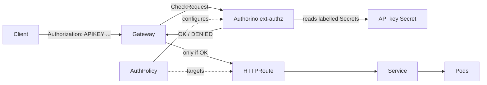

# ACT 4 — Protect API with AuthPolicy

> **Script:** `scripts/15-auth-policy.sh`
> **Overview:** Step 14 encrypted the traffic, but the API is still open to anyone who knows the URL. This step attaches a Kuadrant **`AuthPolicy`** to the `HTTPRoute`, requiring callers to present a valid **API key** before any request reaches the application.

---

## Where We Are

- **Step 12** opened the `Gateway` (HTTP listener on `:80`).
- **Step 13** attached an `HTTPRoute` so traffic reaches `ocp-demo-app`.
- **Step 14** secured the entry point with TLS (HTTPS on `:443`).
- **Step 15 (this step)** controls *who* may call the API — authentication is enforced at the Gateway, before the request hits a pod.

> **Key point:** Like `TLSPolicy`, `AuthPolicy` is a **policy attachment** — it targets the `HTTPRoute` without changing the application code or the route definition. Authentication is layered on by the platform/security team.

---

## Mental Model

**How the pieces cooperate**

| Resource | Owner | Responsibility |
|---|---|---|
| `AuthPolicy` (Kuadrant) | Security | Declares *what* auth to require and *where* to read credentials from |
| Authorino (external authz) | Platform (Kuadrant) | The service the Gateway consults on every request to allow/deny |
| API key `Secret` | Security / App team | Stores a valid key; selected by the policy via labels |
| `HTTPRoute` | App developer | Unchanged — the policy targets it without modification |

> **Key point:** On every matching request, the Gateway calls Authorino (an **external authorization** service). Authorino checks the `Authorization` header against the labelled API key Secrets and replies `OK` or `DENIED` — the app never sees unauthenticated traffic.

---

## How It Fits Together



---

## Steps

### 1. Confirm Prerequisites

`AuthPolicy` needs the Kuadrant CRDs and a present `HTTPRoute` to target:

```bash
oc get crd authpolicies.kuadrant.io
oc get httproute ocp-demo-app -n ocp-demo
```

---

### 2. Baseline — the API is Open

Before applying the policy, anyone can call the API:

```bash
curl -ik --resolve ocp-demo-app.api.<domain>:443:<gateway-address> \
  https://ocp-demo-app.api.<domain>/api/info
# HTTP/1.1 200 OK
```

> **Note:** The script auto-detects whether to use the HTTPS listener from step 14 (`:443`) or the plain HTTP listener (`:80`).

---

### 3. Create the API Key Secret

API keys are stored as **labelled Secrets** that Authorino watches:

```yaml
apiVersion: v1
kind: Secret
metadata:
  name: demo-app-apikey
  labels:
    authorino.kuadrant.io/managed-by: authorino   # Authorino reconciles it
    app: ocp-demo-app                              # selected by the AuthPolicy
stringData:
  api_key: demo-secret-key-123
type: Opaque
```

> **Tip:** The `authorino.kuadrant.io/managed-by: authorino` label tells Authorino to track the Secret; the `app` label is matched by the policy's selector. Adding or revoking a key is just creating or deleting a Secret — no policy change needed.

---

### 4. Apply the AuthPolicy

```yaml
apiVersion: kuadrant.io/v1
kind: AuthPolicy
metadata:
  name: demo-app-auth
  namespace: ocp-demo
spec:
  targetRef:
    group: gateway.networking.k8s.io
    kind: HTTPRoute
    name: ocp-demo-app
  rules:
    authentication:
      "api-key-users":
        apiKey:
          allNamespaces: true
          selector:
            matchLabels:
              app: ocp-demo-app
        credentials:
          authorizationHeader:
            prefix: APIKEY
```

> **Key point:** `targetRef` binds the policy to the `HTTPRoute`. `apiKey.selector` chooses which Secrets count as valid keys. `credentials.authorizationHeader.prefix: APIKEY` means callers send `Authorization: APIKEY <key>`.

---

### 5. Wait for the Policy to be Enforced

```bash
oc wait authpolicy/demo-app-auth -n ocp-demo --for=condition=Enforced --timeout=60s
oc get authpolicy demo-app-auth -n ocp-demo \
  -o jsonpath='{range .status.conditions[*]}{.type}={.status}{"\n"}{end}'
# Accepted=True
# Enforced=True
```

> **Note:** It can take a few seconds after `Enforced=True` for the Gateway's external-authz wiring to start rejecting requests; the script polls until unauthenticated calls return `401`.

---

### 6. Verify Authentication

```bash
# No credentials → rejected
curl -ik --resolve ocp-demo-app.api.<domain>:443:<gw> \
  https://ocp-demo-app.api.<domain>/api/info
# HTTP/1.1 401 Unauthorized
# www-authenticate: APIKEY realm="api-key-users"

# Valid API key → allowed
curl -ik --resolve ocp-demo-app.api.<domain>:443:<gw> \
  -H 'Authorization: APIKEY demo-secret-key-123' \
  https://ocp-demo-app.api.<domain>/api/info
# HTTP/1.1 200 OK
```

> **Note:** A wrong or missing key returns `401`; only requests carrying a valid key reach the application.

---

## Recap

| Concept | Takeaway |
|---|---|
| `AuthPolicy` | Policy attachment that enforces authentication on a route declaratively |
| Authorino | External authorization service the Gateway consults per request |
| API key `Secret` | Labelled Secret holding a valid key — add/revoke without editing the policy |
| `authorizationHeader.prefix` | Defines the credential format (`Authorization: APIKEY <key>`) |
| Separation of concerns | App and `HTTPRoute` are untouched; auth is layered on at the Gateway |

> **Tip:** Authentication answers *who* may call the API. It does **not** limit *how often* they call it. In the next step we add a `RateLimitPolicy` to protect the API from abuse and overload.

---

## ⬅️ Previous: [Secure Traffic with TLSPolicy](14-tls-policy.md) | ➡️ Next: [Protect API with RateLimitPolicy](16-rate-limit-policy.md)
