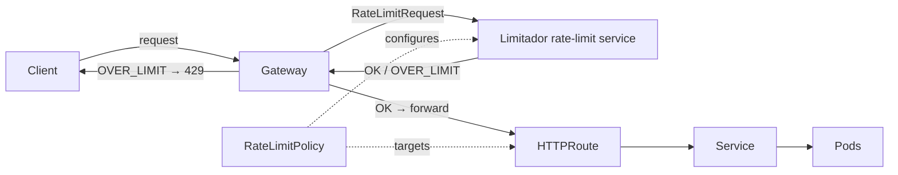

# ACT 4 — Protect API with RateLimitPolicy

> **Script:** `scripts/16-rate-limit-policy.sh`
> **Overview:** Step 15 controlled *who* may call the API. This step controls *how often* they may call it. A Kuadrant **`RateLimitPolicy`** attached to the `HTTPRoute` caps request volume at the Gateway — excess calls are rejected with **HTTP 429 (Too Many Requests)** before they ever reach the application.

---

## Where We Are

- **Step 12** opened the `Gateway` (HTTP listener on `:80`).
- **Step 13** attached an `HTTPRoute` so traffic reaches `ocp-demo-app`.
- **Step 14** secured the entry point with TLS (HTTPS on `:443`).
- **Step 15** required a valid API key (authentication).
- **Step 16 (this step)** caps request volume — protecting the app from abuse, runaway clients and overload.

> **Key point:** `RateLimitPolicy` is another **policy attachment** — it targets the `HTTPRoute` without touching the app or the route. Throttling is layered on by the platform/security team.

---

## Mental Model

**How the pieces cooperate**

| Resource | Owner | Responsibility |
|---|---|---|
| `RateLimitPolicy` (Kuadrant) | Security / Platform | Declares the quota (*N requests per window*) and where it applies |
| Limitador (rate-limit service) | Platform (Kuadrant) | The counter service the Gateway consults on every request |
| `HTTPRoute` | App developer | Unchanged — the policy targets it without modification |

> **Key point:** On every matching request, the Gateway asks Limitador whether the counter is within budget. Limitador replies `OK` or `OVER_LIMIT`; only allowed requests continue to the app.

---

## How It Fits Together



---

## Steps

### 1. Confirm Prerequisites

`RateLimitPolicy` needs the Kuadrant CRDs and a present `HTTPRoute` to target:

```bash
oc get crd ratelimitpolicies.kuadrant.io
oc get httproute ocp-demo-app -n ocp-demo
```

---

### 2. Apply the RateLimitPolicy

The demo uses a deliberately low limit so the throttle is easy to trigger live:

```yaml
apiVersion: kuadrant.io/v1
kind: RateLimitPolicy
metadata:
  name: demo-app-ratelimit
  namespace: ocp-demo
spec:
  targetRef:
    group: gateway.networking.k8s.io
    kind: HTTPRoute
    name: ocp-demo-app
  limits:
    "demo-limit":
      rates:
        - limit: 5
          window: 10s
```

> **Key point:** `targetRef` binds the policy to the `HTTPRoute`. The `limits` block defines named limit sets; each `rates` entry is a `limit` (max requests) over a rolling `window`. Here: **5 requests per 10 seconds**.

> **Tip:** Limits can be scoped per-user with `counters` (e.g. `auth.identity.username`) and activated conditionally with `when`. This demo uses a single global counter for clarity.

---

### 3. Wait for the Policy to be Enforced

```bash
oc wait ratelimitpolicy/demo-app-ratelimit -n ocp-demo --for=condition=Enforced --timeout=60s
oc get ratelimitpolicy demo-app-ratelimit -n ocp-demo \
  -o jsonpath='{range .status.conditions[*]}{.type}={.status}{"\n"}{end}'
# Accepted=True
# Enforced=True
```

> **Note:** As with the AuthPolicy, it can take a few seconds after `Enforced=True` for the Gateway's rate-limit wiring to activate; the script polls until a burst starts returning `429`.

---

### 4. Demonstrate the Limit

Fire a burst that exceeds the quota. Because the `AuthPolicy` from step 15 is still active, each call carries the API key:

```bash
for i in $(seq 1 8); do
  curl -sk -o /dev/null -w '%{http_code}\n' \
    --resolve ocp-demo-app.api.<domain>:443:<gw> \
    -H 'Authorization: APIKEY demo-secret-key-123' \
    https://ocp-demo-app.api.<domain>/api/info
done
# 200
# 200
# 200
# 200
# 200
# 429   ← limit reached
# 429
# 429
```

> **Note:** The first 5 requests succeed; once the 10-second budget is spent, further calls return `429 Too Many Requests` until the window rolls over.

---

## Recap

| Concept | Takeaway |
|---|---|
| `RateLimitPolicy` | Policy attachment that caps request volume on a route declaratively |
| Limitador | External rate-limit counter service the Gateway consults per request |
| `rates.limit` / `rates.window` | Define the quota: max requests per rolling time window |
| HTTP `429` | Returned to clients once the limit is exceeded |
| Layered protection | TLS + Auth + Rate limiting all attach to the same route without code changes |

> **Tip:** Auth answers *who*, rate limiting answers *how often*. Both are static rules. The next step adds **runtime authorization with external metadata** — decisions that depend on data fetched live from an external service.

---

## ⬅️ Previous: [Protect API with AuthPolicy](15-auth-policy.md) | ➡️ Next: [Advanced Authorization with External Metadata](17-external-metadata.md)
